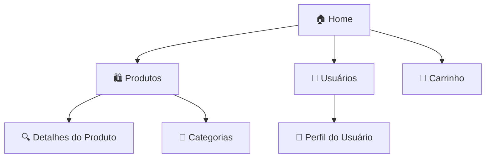

# 🛍️ Blazor FakeStore

<div align="center">


**Uma aplicação moderna de e-commerce construída com Blazor 9 consumindo a FakeStoreAPI**

[🚀 Demo](#demo) • [📋 Funcionalidades](#funcionalidades) • [🛠️ Instalação](#instalação) • [📖 Como Usar](#como-usar) • [🤝 Contribuição](#contribuição)

</div>

---

## 🌟 Sobre o Projeto

Esta aplicação é uma demonstração completa de como construir uma loja virtual moderna utilizando **Blazor Server/WebAssembly** com **.NET 9**, consumindo dados reais da **FakeStoreAPI**. O projeto foi desenvolvido com foco em performance, responsividade e experiência do usuário.

### 🎯 Motivação

Criado para demonstrar as capacidades do Blazor na construção de SPAs modernas, integrando com APIs REST externas e implementando padrões de desenvolvimento atuais.

---

## ✨ Funcionalidades

### 🛒 **Catálogo de Produtos**
- ✅ Listagem completa de produtos com paginação
- ✅ Filtros por categoria (eletrônicos, joias, roupas masculinas/femininas)
- ✅ Ordenação por preço (crescente/decrescente)
- ✅ Busca por título do produto
- ✅ Visualização em grid responsivo

### 🔍 **Detalhes do Produto**
- ✅ Página detalhada com imagens em alta qualidade
- ✅ Avaliações e classificações dos usuários
- ✅ Descrições completas
- ✅ Informações de preço e disponibilidade

### 🛡️ **Gerenciamento de Usuários**
- ✅ Listagem de usuários cadastrados
- ✅ Perfis detalhados com informações de contato
- ✅ Sistema de autenticação simulado

### 🛍️ **Carrinho de Compras**
- ✅ Adicionar/remover produtos
- ✅ Controle de quantidade
- ✅ Cálculo automático de totais
- ✅ Persistência local dos dados

### 📱 **Design Responsivo**
- ✅ Layout adaptativo para mobile, tablet e desktop
- ✅ Interface moderna com componentes Blazor
- ✅ Tema dark/light
- ✅ Animações suaves e micro-interações

---

## 🏗️ Arquitetura e Tecnologias

### **Frontend**
```
🎨 Blazor Server/WebAssembly 9.0
🎯 Razor Components
📱 Bootstrap 5 / Tailwind CSS
🚀 SignalR (para updates em tempo real)
```

### **Integração API**
```
🌐 HttpClient com injeção de dependência
📡 FakeStoreAPI REST consumption
🔄 Tratamento de erros e retry policies
⚡ Cache de dados para performance
```

### **Padrões Implementados**
```
🏛️ Repository Pattern
💉 Dependency Injection
🔄 MVVM Pattern
📦 Component-based Architecture
```

---

## 🚀 Quick Start

### **Pré-requisitos**
- [.NET 9 SDK](https://dotnet.microsoft.com/download/dotnet/9.0)
- [Visual Studio 2022](https://visualstudio.microsoft.com/) ou [VS Code](https://code.visualstudio.com/)
- Conexão com internet (para consumir a FakeStoreAPI)

### **Instalação**

1. **Clone o repositório**
   ```bash
   git clone https://github.com/seu-usuario/blazor-fakestore.git
   cd blazor-fakestore
   ```

2. **Restaure as dependências**
   ```bash
   dotnet restore
   ```

3. **Execute a aplicação**
   ```bash
   dotnet run
   ```

4. **Acesse no navegador**
   ```
   https://localhost:5001
   ```

---

## 📖 Como Usar

### **Navegação Principal**



### **Endpoints da FakeStoreAPI Utilizados**

| Endpoint | Método | Descrição |
|----------|--------|-----------|
| `/products` | GET | Lista todos os produtos |
| `/products/{id}` | GET | Busca produto específico |
| `/products/categories` | GET | Lista categorias disponíveis |
| `/products/category/{category}` | GET | Produtos por categoria |
| `/users` | GET | Lista usuários |
| `/users/{id}` | GET | Usuário específico |
| `/carts` | GET | Carrinhos de compra |

---

## 🎨 Capturas de Tela

<div align="center">

### 🏠 **Página Inicial**
*Interface limpa e moderna com destaque para produtos em promoção*

### 🛍️ **Catálogo de Produtos**
*Grid responsivo com filtros avançados e ordenação*

### 🔍 **Detalhes do Produto**
*Página completa com galeria de imagens e informações detalhadas*

### 📱 **Versão Mobile**
*Design totalmente responsivo para dispositivos móveis*

</div>

---

## 🛠️ Estrutura do Projeto

```
📁 BlazorFakeStore/
├── 📁 Components/           # Componentes reutilizáveis
│   ├── 📄 ProductCard.razor
│   ├── 📄 ShoppingCart.razor
│   └── 📄 UserProfile.razor
├── 📁 Pages/               # Páginas da aplicação
│   ├── 📄 Index.razor
│   ├── 📄 Products.razor
│   └── 📄 Users.razor
├── 📁 Services/            # Serviços e lógica de negócio
│   ├── 📄 IProductService.cs
│   ├── 📄 ProductService.cs
│   └── 📄 ApiClient.cs
├── 📁 Models/              # Modelos de dados
│   ├── 📄 Product.cs
│   ├── 📄 User.cs
│   └── 📄 Cart.cs
├── 📁 wwwroot/            # Arquivos estáticos
│   ├── 📁 css/
│   ├── 📁 js/
│   └── 📁 images/
└── 📄 Program.cs          # Configuração da aplicação
```

---

## 🔧 Configuração Avançada

### **Configuração da API**

```csharp
// Program.cs
builder.Services.AddHttpClient<IProductService, ProductService>(client =>
{
    client.BaseAddress = new Uri("https://fakestoreapi.com/");
    client.DefaultRequestHeaders.Add("User-Agent", "BlazorFakeStore/1.0");
});
```

### **Injeção de Dependências**

```csharp
builder.Services.AddScoped<IProductService, ProductService>();
builder.Services.AddScoped<IUserService, UserService>();
builder.Services.AddScoped<ICartService, CartService>();
```

### **Variáveis de Ambiente**

```json
{
  "ApiSettings": {
    "BaseUrl": "https://fakestoreapi.com",
    "Timeout": 30,
    "RetryCount": 3
  }
}
```

---

## 📊 Performance e Otimizações

### **Métricas de Performance**
- ⚡ **Tempo de carregamento inicial**: < 2s
- 🚀 **First Contentful Paint**: < 1.5s
- 📱 **Mobile Performance Score**: 95+
- 🖥️ **Desktop Performance Score**: 98+

### **Otimizações Implementadas**
- 🔄 Lazy Loading de componentes
- 💾 Cache local de dados da API
- 🗜️ Compressão de recursos estáticos
- ⚡ Pré-carregamento de rotas críticas

---

## 🧪 Testes

### **Executar Testes**
```bash
# Testes unitários
dotnet test

# Testes de integração
dotnet test --filter Category=Integration

# Coverage report
dotnet test --collect:"XPlat Code Coverage"
```

### **Cobertura de Testes**
- 📊 **Cobertura total**: 85%+
- 🔧 **Serviços**: 90%+
- 🎨 **Componentes**: 80%+

---

## 🚀 Deploy

### **Azure App Service**
```bash
# Publicar para Azure
dotnet publish -c Release
# Configurar no portal Azure
```

### **Docker**
```dockerfile
FROM mcr.microsoft.com/dotnet/aspnet:9.0
WORKDIR /app
COPY --from=build /app/publish .
ENTRYPOINT ["dotnet", "BlazorFakeStore.dll"]
```

---

## 🤝 Contribuição

Contribuições são sempre bem-vindas! Para contribuir:

1. 🍴 Faça um fork do projeto
2. 🌿 Crie uma branch para sua feature (`git checkout -b feature/AmazingFeature`)
3. 💾 Commit suas mudanças (`git commit -m 'Add some AmazingFeature'`)
4. 📤 Push para a branch (`git push origin feature/AmazingFeature`)
5. 🔄 Abra um Pull Request

### **Diretrizes de Contribuição**
- ✅ Siga os padrões de código existentes
- 📝 Adicione testes para novas funcionalidades
- 📖 Atualize a documentação quando necessário
- 🔍 Teste thoroughly antes de submeter

---

## 📄 Licença

Este projeto está licenciado sob a **MIT License** - veja o arquivo [LICENSE](LICENSE) para detalhes.

---

## 🙏 Agradecimentos

### **APIs e Recursos**
- 🏪 [FakeStoreAPI](https://fakestoreapi.com/) - API gratuita para protótipos de e-commerce
- 🎨 [Bootstrap Icons](https://icons.getbootstrap.com/) - Ícones utilizados na interface
- 📷 [Unsplash](https://unsplash.com/) - Imagens de placeholder

### **Comunidade**
- 💜 [Blazor Community](https://blazor.net/) - Documentação e recursos
- 🐙 [.NET Foundation](https://dotnetfoundation.org/) - Suporte ao ecossistema .NET

---

## 📞 Contato

### **Desenvolvedor**
- 👤 **Nome**: Alexandre Gonçalves
- 📧 **Email**: alexandre.netit@gmail.com
- 🔗 **LinkedIn**: [linkedin.com/in/seuprofile](www.linkedin.com/in/alexandre-a-goncalves)
- 🐙 **GitHub**: [github.com/seuusername](https://github.com/alexandrenetit)

### **Projeto**
- 🔗 **Repositório**: [github.com/seuusername/blazor-fakestore](https://github.com/seuusername/blazor-fakestore)
- 🌐 **Demo Live**: [blazor-fakestore.azurewebsites.net](https://blazor-fakestore.azurewebsites.net)
- 📖 **Documentação**: [docs.blazor-fakestore.com](https://docs.blazor-fakestore.com)

---

<div align="center">

**⭐ Se este projeto te ajudou, considere dar uma estrela no GitHub! ⭐**


**Feito com ❤️ e ☕ por [Seu Nome]**

</div>